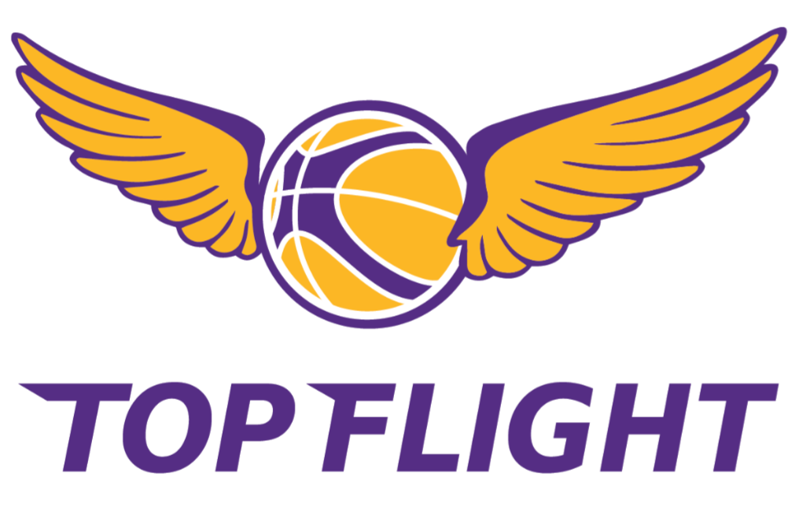

# SportsSage Basketball Academy Chatbot

Welcome to the SportsSage Basketball Academy Chatbot! This chatbot uses Natural Language Processing (NLP) to understand and respond to various user inputs. It also includes a web scraping feature to provide information about different basketball leagues.

## Setup

### Prerequisites:

You'll need Python 3.7 or later installed on your computer. You'll also need the following Python libraries:

- PyTorch
- NLTK
- Beautiful Soup
- Pandas

You can install these using pip: pip install torch nltk beautifulsoup4 pandas

### Running the Chatbot:

The chatbot can be run from the command line. Navigate to the directory containing the chatbot files and run the following command:

## Overview

The `chat.py` script is the main script that runs the chatbot. Here's a brief overview of how it works:

1. The script begins by importing the necessary modules and setting up the device for PyTorch computations.
2. It then loads the trained model and the intents from a JSON file.
3. The chatbot enters into a while loop, where it waits for user input. If the input is "quit", it breaks the loop and the chatbot stops.
4. If the input matches one of the keys in the data dictionary, it will scrape the data and print the standings.
5. If the input does not match, it tokenizes the input and transforms it into a bag-of-words tensor. This tensor is then fed into the model which produces an output. The output is a tag that corresponds to the type of user intent.
6. The chatbot then selects a random response from the corresponding tag and prints it.

## Web Scraping Feature

The chatbot includes a web scraping feature that uses Beautiful Soup to parse HTML and extract data from league tables. The HTML for the tables is stored in a Python dictionary, and the `extract_data` function takes a key from this dictionary, parses the HTML, and returns a Pandas DataFrame with the table data.

## Example Interactions

Here are a few examples of how the chatbot may respond to various user inputs. The responses are chosen randomly from a list of possible responses associated with each intent tag.

**User:** "Hi"

**Bot:** "Hello! Thank you for Visiting Top Flight Basketball Academy, How can I help?"

**User:** "Bye"

**Bot:** "See you later!, Thanks for visiting the Top Flight Website."

**User:** "Thanks"

**Bot:** "Happy to help!"

**User:** "How much?"

**Bot:** "Here is the link to our price sheet: [link](URL_HERE)"

**User:** "Which classes do you have?"

**Bot:** "We offer many classes here at Top Flight led by our amazing instructors. At the moment, the programs we offer are: After-school Programs, Weekend Academy, The Elite Program, International Camps, and Private Coaching."

**User:** "Do you take credit cards?"

**Bot:** "We only accept Bank transfers at the moment, please transfer to: Bank Details"

**User:** "What is special about Top Flight?"

**Bot:** "Top Flight is special because it offers:

- Expertise from a former D1 athlete and NCAA National Champion.
- Individualized attention and specifically designed training programs.
- An optimal student-to-coach ratio.
- Realistic opportunities to play basketball at the next level.
- A worldwide coaching network and professional coaches licensed by leading governing bodies.

Top Flight delivers a unique basketball training experience."
